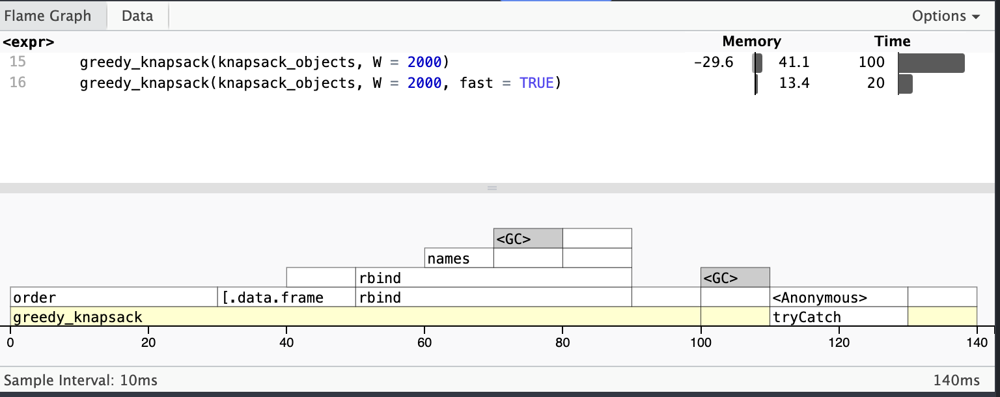
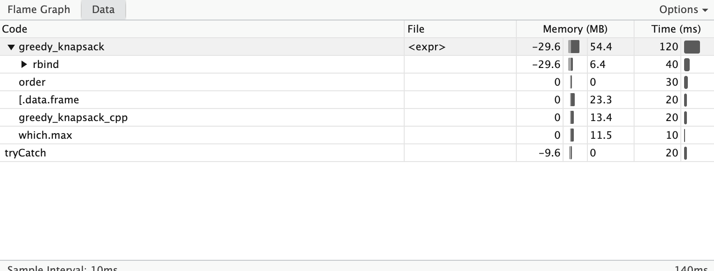

```{r, include = FALSE}
knitr::opts_chunk$set(
  collapse = TRUE,
  comment = "#>"
)
```
The knapsack problem is a classic optimization problem where the goal is to maximize the total value of items placed in a knapsack without exceeding its weight capacity. This report explores three different algorithms to solve the knapsack problem: brute force, dynamic programming, and greedy approach.

## Setup
```{r setup}
library(advr.06)
```

### RNG Setup
```{r}
suppressWarnings(RNGversion(min(as.character(getRversion()), "3.5.3")))
set.seed(42, kind = "Mersenne-Twister", normal.kind = "Inversion")
n <- 2000
knapsack_objects <- data.frame(
  w = sample(1:4000, size = n, replace = TRUE),
  v = runif(n = n, 0, 10000)
)
```

## Brute Force Approach

The `brute_force_knapsack()` function evaluates all possible combinations of items to find the optimal solution. It guarantees the best possible value but has exponential time complexity $O(2^n)$.

```{r}
st <- system.time(bfk <- brute_force_knapsack(x = knapsack_objects[1:16,], W = 2000))
st
bfk
```

Q: How much time does it take to run the algorithm for n = 16 objects?

> `r st[3]` seconds

## Dynamic Programming Approach

The `knapsack_dynamic()` function uses dynamic programming to solve the knapsack problem optimally. It builds a table of subproblems with time complexity $O(nW)$, making it efficient for problems with reasonable weight limits.

```{r}
st <- system.time(kd <- knapsack_dynamic(x = knapsack_objects[1:500,], W = 2000))
st
kd
```

Q: How much time does it take to run the algorithm for n = 500 objects?

> `r st[3]` seconds

## Greedy Approach

The `greedy_knapsack()` function uses a heuristic approach that sorts items by value-to-weight ratio and selects them greedily. This method is very fast with $O(n \, log \, n)$ complexity but may not always find the optimal solution.

### R Implementation

```{r}
n <- 1000000
knapsack_objects <- data.frame(
  w = sample(1:4000, size = n, replace = TRUE),
  v = runif(n = n, 0, 10000)
)

st <- system.time(gk <- greedy_knapsack(x = knapsack_objects, W = 2000))
st
gk
```

Q: How much time does it take to run the algorithm for n = 1,000,000 objects?

> `r st[3]` seconds

### Profiling the Greedy Algorithm
To profile the greedy algorithm, using the `profvis` package, a comparison between the R and C++ implementations can be visualized. It can be seen, that the C++ implementation is significantly faster, since R's `rbind` function reduced performance.

```{r, eval = FALSE}
suppressWarnings(RNGversion(min(as.character(getRversion()), "3.5.3")))
set.seed(42, kind = "Mersenne-Twister", normal.kind = "Inversion")
n <- 10000000
knapsack_objects <- data.frame(
  w = sample(1:4000, size = n, replace = TRUE),
  v = runif(n = n, 0, 10000)
)
profvis({
  greedy_knapsack(knapsack_objects, W = 2000)
  greedy_knapsack(knapsack_objects, W = 2000, fast = TRUE)
})
```



Q: What performance gain could you get by trying to improving your code?

> The C++ implementation is ~3x faster than the R implementation.

### C++ Implementation (fast = TRUE)

The greedy_knapsack supports a `fast` parameter that uses a C++ implementation for improved performance.
That implementation is not the fastet possible, since it was designed to be as similar as possible to the R implementation.

```{r}
st_cpp <- system.time(gk_cpp <- greedy_knapsack(x = knapsack_objects, W = 2000, fast = TRUE))
st_cpp
gk_cpp
```

Q: How much time does it take to run the C++ algorithm for n = 1,000,000 objects?

> `r st_cpp[3]` seconds

Q: What performance gain could you get by using Rcpp and C++?

> `r round(st[3] / st_cpp[3], 1)`x faster than the R implementation.
